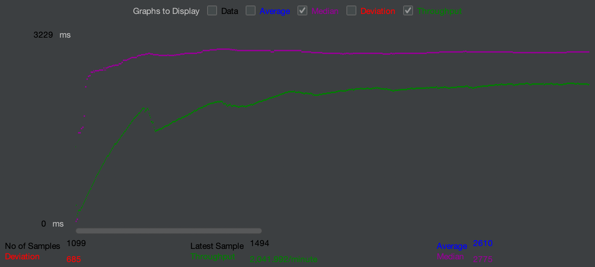
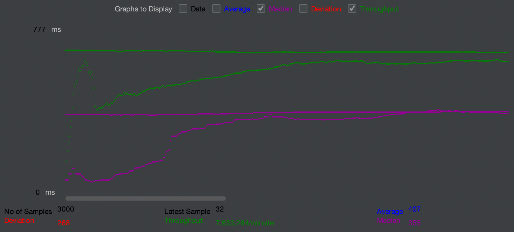

explain analyse до добавления индекса
```sql
Gather  (cost=1000.00..28752.29 rows=5674 width=60) (actual time=110.008..155.962 rows=5258 loops=1)
  Workers Planned: 2
  Workers Launched: 2
  ->  Parallel Seq Scan on users  (cost=0.00..27184.89 rows=2364 width=60) (actual time=85.450..126.769 rows=1753 loops=3)
        Filter: ((first_name ~~ 'Р%'::text) AND (second_name ~~ 'А%'::text))
        Rows Removed by Filter: 506508
Planning Time: 6.982 ms
Execution Time: 156.547 ms

```

ниже представлен график до добавления индекса



explain analyse после добавления индекса
```sql
Bitmap Heap Scan on users  (cost=3171.95..15094.84 rows=5674 width=60) (actual time=35.384..42.969 rows=5258 loops=1)
  Recheck Cond: ((first_name ~~ 'Р%'::text) AND (second_name ~~ 'А%'::text))
  Heap Blocks: exact=281
  ->  BitmapAnd  (cost=3171.95..3171.95 rows=5674 width=0) (actual time=35.193..35.197 rows=0 loops=1)
        ->  Bitmap Index Scan on users_search_index_gin  (cost=0.00..247.68 rows=26624 width=0) (actual time=3.892..3.893 rows=24386 loops=1)
              Index Cond: (first_name ~~ 'Р%'::text)
        ->  Bitmap Index Scan on users_search_index_second_name_gin  (cost=0.00..2921.19 rows=324959 width=0) (actual time=31.283..31.283 rows=325119 loops=1)
              Index Cond: (second_name ~~ 'А%'::text)
Planning Time: 1.106 ms
Execution Time: 43.622 ms

```

ниже представлен график после добавления индекса


индексы представлены в миграции, но продублирую еще раз:
```sql
CREATE INDEX users_search_index_gin on users using gin (first_name gin_trgm_ops);
CREATE INDEX users_search_index_second_name_gin on users using gin (second_name gin_trgm_ops);

```
